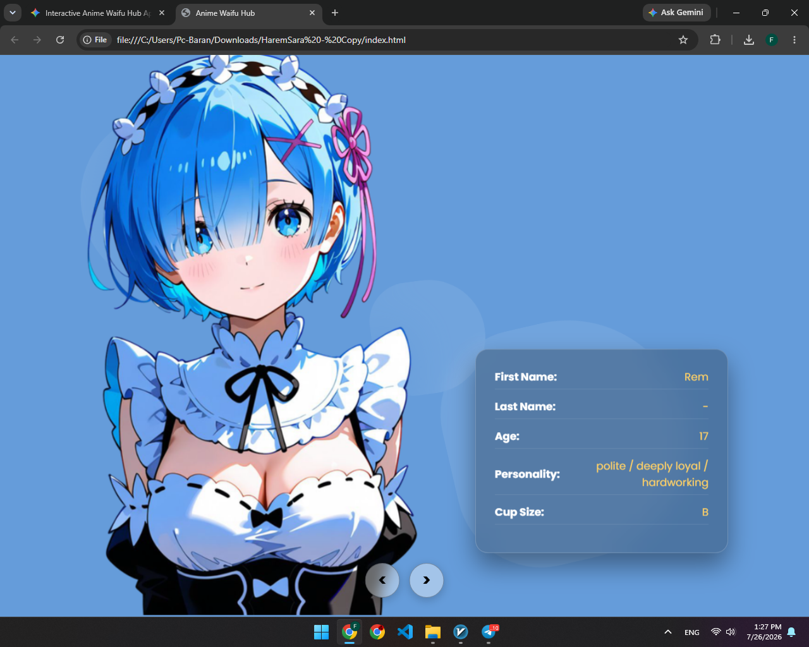
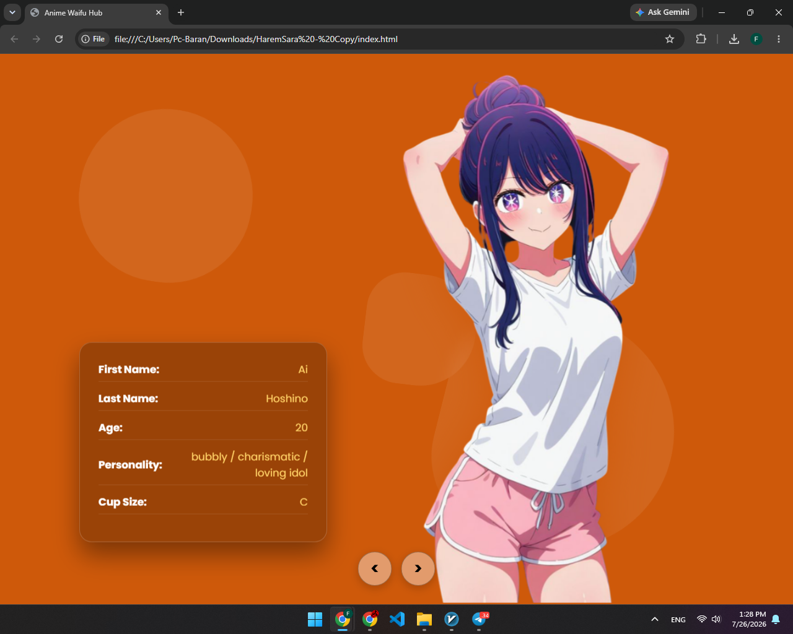
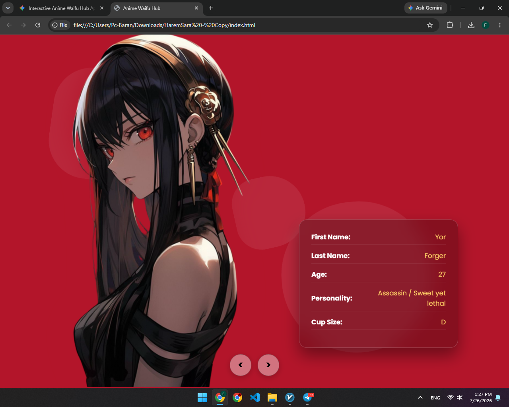

# 🌸 Waifu Page

> **A modern anime-inspired landing page with smooth animations, responsive design, and a clean user experience.**


---

## ✨ Overview

**Waifu Page** is a stylish anime-themed landing page designed with a modern UI, smooth animations, and responsive layouts. The project focuses on delivering a visually pleasing experience while keeping the code clean and lightweight.

---

## 🚀 Features

* 🎨 Beautiful Anime UI
* ⚡ Smooth Animations
* 📱 Fully Responsive Design
* 🌙 Modern & Clean Layout
* 💻 Lightweight and Fast
* 🛠 Easy to Customize

---

# 📸 Screenshots

## 🏠 Home

<p align="center">
  
</p>

---

## 🌸 Character Section

<p align="center">
  
</p>

---

## ✨ Preview

<p align="center">
  
</p>

---

## 🛠 Built With

* HTML5
* CSS3
* JavaScript

---

## 📂 Project Structure

```text
Waifu-Page
│
├── ScreenShots
│   ├── scr1.png
│   ├── scr2.png
│   └── scr3.png
│
├── index.html
├── style.css
├── script.js
└── README.md
```

---

## 🚀 Getting Started

Clone the repository:

```bash
git clone https://github.com/opxerexe/Waifu-Page.git
```

Open the project:

```bash
cd Waifu-Page
```

Finally, open **index.html** in your browser.

---

## ❤️ Support

If you like this project, consider giving it a ⭐ on GitHub.

---

## 📄 License

This project is released under the **MIT License**.
